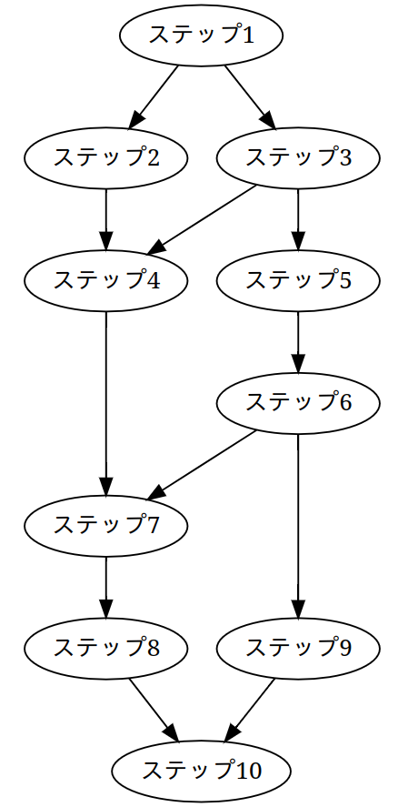

# Coq勉強会の資料

- タクティックの基礎からクイックソートの証明までを10ステップ49問にまとめました
- 各ステップの依存関係はgraph.pngにて図解しています
- 各問題には解答があります。answer.vを確認してください

## インストール

次のツールをインストールしてください
1. Coq(本体)
2. MathComp-SSReflect
3. CoqIDE

インストールできましたら、CoqIDEでdocument.vを開いてください

## 想定読者

- 強い静的型付けが行われる関数型プログラミングに慣れた方
  - (例えば、Haskell、OCamlといった言語を触ったことがある方)
- 代数的データ構造とパターンマッチがある言語を触ったことがある方

## 目指すレベル

- 基本的なSSReflectのタクティックの機能を使って証明できる
- 帰納型の定義を見て理解できる
- クイックソート程度のアルゴリズムの証明ができる
- 四則演算の簡単な定理の証明ができる

## 扱わない内容

- uniqueやsigma-typeといった型
- モジュールシステム
- リフレクション

## 各ステップの概要

- ステップ1
  - ラムダ式と関数呼び出しを用いて簡単な証明をする
  - タクティックは使いません
- ステップ2
  - andとorを用いて証明する
  - タクティックは使いません
- ステップ3
  - exactとapply
- ステップ4
  - caseとsplit
- ステップ5
  - rewriteとexists
- ステップ6
  - induction(帰納法)
  - Coqを少し触る方はQ6-3(加算の交換律)まで解くのがおすすめです
- ステップ7
  - bool型とProp型
- ステップ8
  - 排中律
- ステップ9
  - リストの関数の証明
  - Coqに入門する方はQ9-7(2重にreverseすると元に戻ることの証明)まで解くのがおすすめです
- ステップ10
  - クイックソートがソートできることの証明
  - Q10-10まで解けたらなかなかのものです。是非挑戦してみてください

## 各ステップの依存関係

